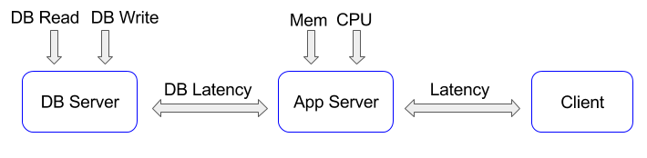

## coog-bench

### Description

coog-bench is a tools to check coog (or trytond) deployment. It verifies:
- connectivity between client / application server (trytond) / db server
- cpu / memory capabilities of application server
- db capabilities for read / write operations

### Installation

- [bench module](https://github.com/coopengo/trytond-bench) should be installed on trytond

#### Dev mode

- local run: `npm i && npm run start` (you could need to change `browser-sync` proxy configuration)

#### Real deployment

- local build: `npm i && npm run build` (generated files on public folder)
- build without installing node: `cd docker && ./build` (generated files are on content folder)
- serve generated files via nginx or other standard web server

### Bench

The bench features an option to export the bench results. It will download a csv file of the lastest average results.

### License

[See LICENSE](./LICENSE)

### Copyright

[See COPYRIGHT](./COPYRIGHT)

For more information please visit the Coopengo web site :

http://www.coopengo.com
