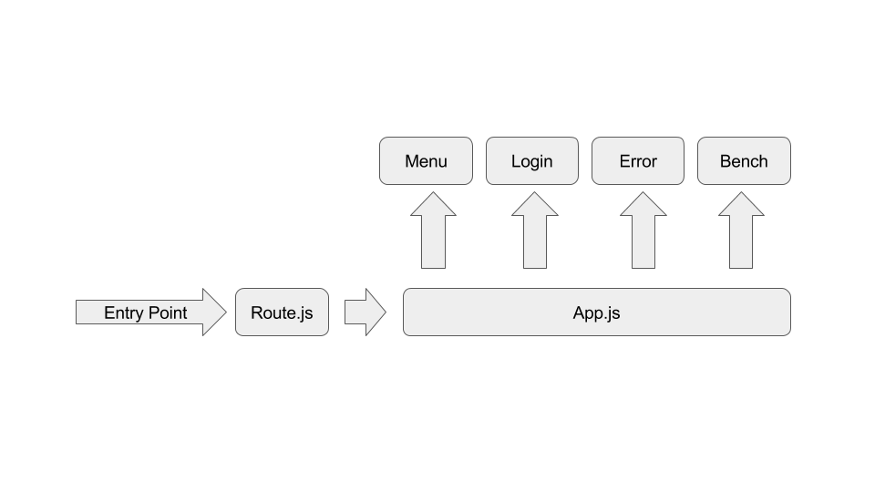

# coog-bench

DESCRIPTION
-----------

The bench module offers possibilities to obtain data about execution processes.

USAGE
-----

### Login

The user needs to log in, submitting its database, username and password.

### Bench

+ The menu bar above contains 4 buttons : 
  - Information : Gives the user different kind of information.
  - Refresh : Allows the user to reload the entire page.
  - Drop : Drops the table that is already running and that needs to be 
  teardowned. 
  - Logout : Closes the session.

+ Launching the bench is done by clicking which category you want to enable or 
disable and then clicking on the button underneath.

### Errors

If the bench cannot operate, an error message will appear, explaining the 
situation. 
You can dismiss it by clicking the cross.

ARCHITECTURE 
------------

### Backbone 

Backbone.js is a lightweight JavaScript library that gives structure to web 
applications by providing models with key-value binding and custom events, 
collections with a rich API of enumerable functions, views with declarative 
event handling, and connects it all to your existing API over a RESTful JSON 
interface. 
It makes it easy to manage and decouple concerns in your application, leaving 
you with code that is more maintainable in the long term. 

What you need to know : 
- A view renders model data, and registers events.
- When an event is fired via user input, we can run some kind of callback or 
function which communicates with the model.
- Inside the model, the logic gets performed. In a real world scenario, 
you’ll probably also be updating a database here.
- The model change fires off an event.
- The view picks up on that event, and acts accordingly, possibly re-rendering 
itself.

To allow plugins to communicate with each other, we use Backbone events. One 
plugin triggers an event and the other plugin acts when it has listened to the 
matching event. 
By doing this, if one plugin is not responding (for any kind of reason), it 
doesn't block the whole application. 

For more information please visit Backbone web site: [http://backbonejs.org/](http://backbonejs.org/)

### Our application

The bench is based on app.js and route.js. They call 4 plugins which constitute 
the actual bench : 

+ Bench
It executes calls to the server and retrives the wanted results.
It also takes care of droping the table when asked. 

+ Error
It deals with displaying error messages.

+ Menu
It triggers functions linked to its buttons. 

+ Session
It handles the session by checking the inputs. It stores the information in 
the local storage.

License
-------

See LICENSE

Copyright
---------

See COPYRIGHT

For more information please visit the Tryton web site:

http://www.tryton.org/
